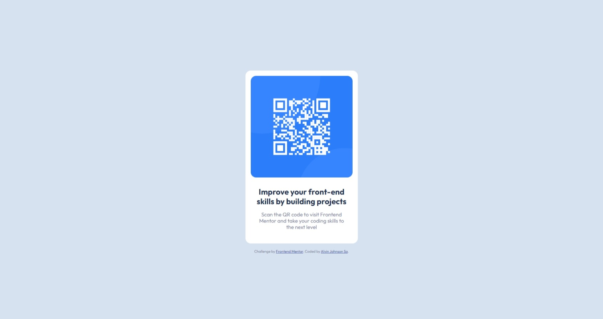

# Frontend Mentor - QR code component solution

This is a solution to the [QR code component challenge on Frontend Mentor](https://www.frontendmentor.io/challenges/qr-code-component-iux_sIO_H). Frontend Mentor challenges help you improve your coding skills by building realistic projects.

## Table of contents

- [Frontend Mentor - QR code component solution](#frontend-mentor---qr-code-component-solution)
  - [Table of contents](#table-of-contents)
  - [Overview](#overview)
    - [Screenshot](#screenshot)
    - [Links](#links)
  - [My process](#my-process)
    - [Built with](#built-with)
    - [What I learned](#what-i-learned)
  - [Author](#author)

## Overview

### Screenshot

### Links

- Solution URL: [Add solution URL here](https://www.frontendmentor.io/solutions/qr-code-component-AY591GT234)
- Live Site URL: [Add live site URL here](https://fm-qr-code-component-main-gules.vercel.app/)

## My process

### Built with

- Semantic HTML5 markup
- CSS Grid
- Mobile-first workflow

### What I learned

None really. I'm just familiarizing myself with the things I learned on the [Product Preview Card Component Challenge](https://github.com/alvinjohnsonso/fm-product-preview-card-component).

## Author

- Frontend Mentor - [@alvinjohnsonso](https://www.frontendmentor.io/profile/alvinjohnsonso)
- Github - [@alvinjohnsonso](https://github.com/alvinjohnsonso)
